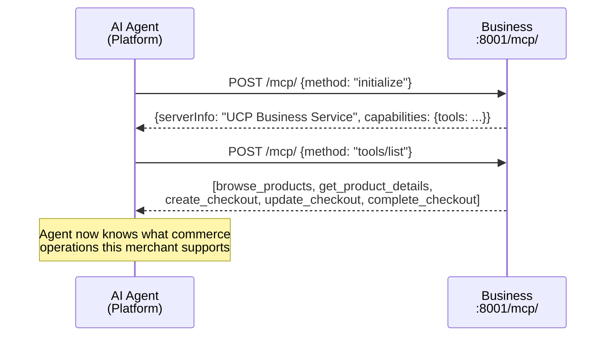
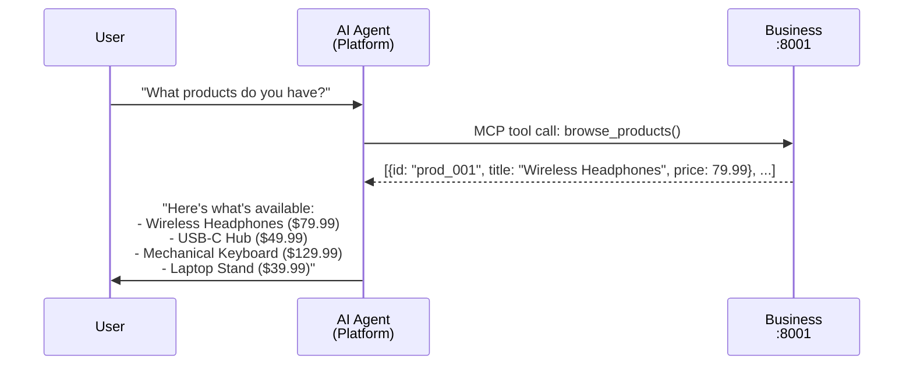
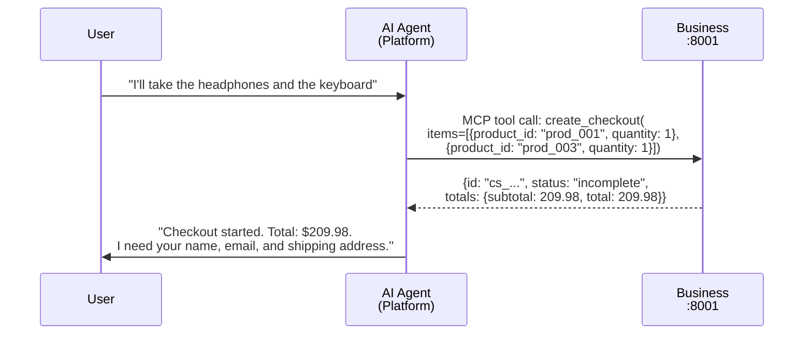
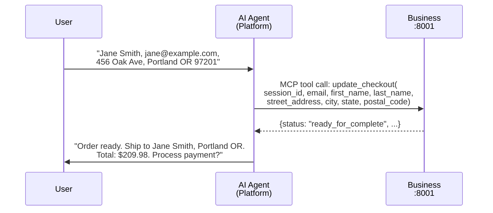
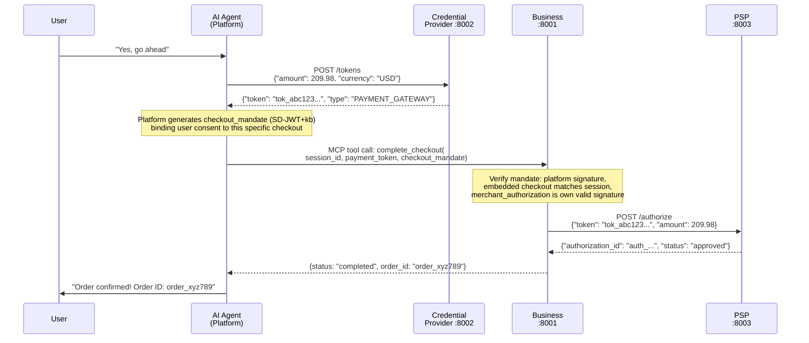
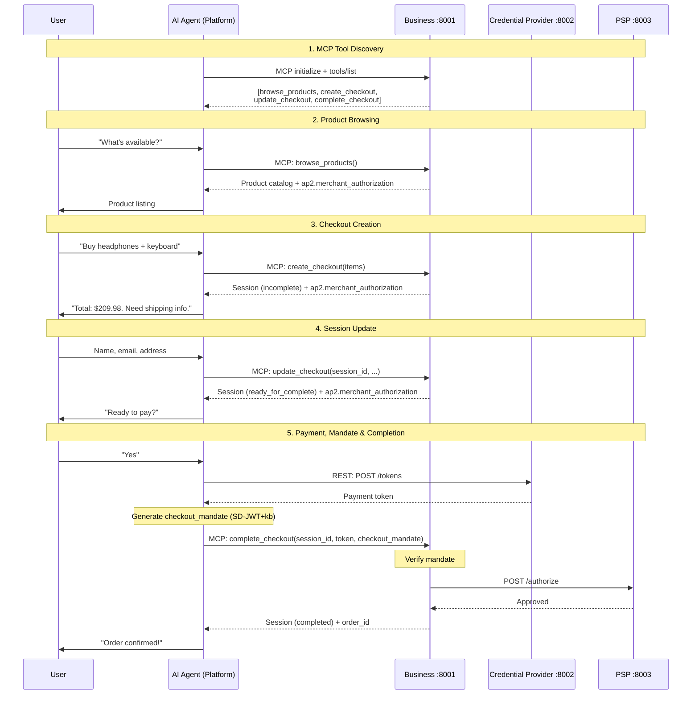
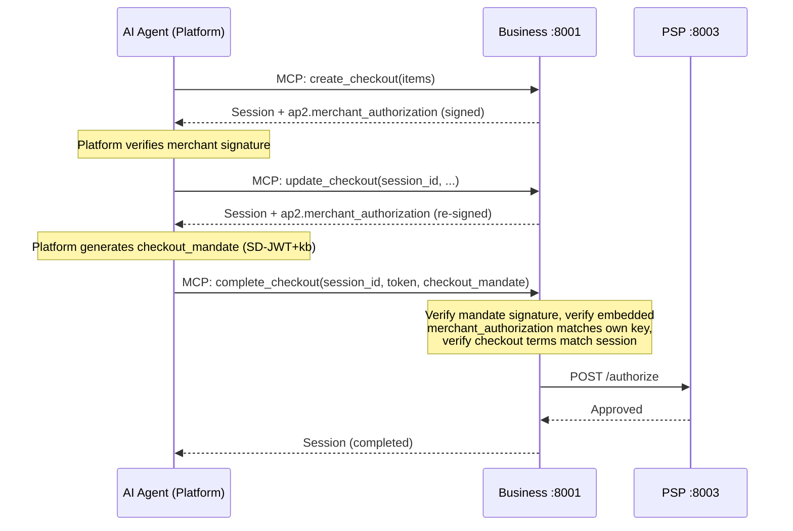

# UCP Agentic Commerce Demo

A sample implementation of agentic commerce using the [Universal Commerce Protocol (UCP)](https://ucp.dev/). AI shopping assistants guide users through product discovery and checkout — entirely through a chat interface.

UCP is an open standard co-developed by Google, Shopify, Etsy, Walmart, Target, and Wayfair that defines how platforms, AI agents, and businesses conduct commerce.

This demo includes two modes: a **single-store** frontend that talks directly to one merchant, and a **multi-store** frontend that searches across multiple merchants via an aggregator service.

## Architecture

### Single-Store Mode

The original frontend connects directly to one merchant's MCP endpoint:

```
┌──────────────────────────────────────────────────────┐
│         Next.js Chat App (Platform / Agent)          │
│         Vercel AI SDK + Claude tool calling          │
│         AP2 key pair + mandate generation            │
│                   localhost:3000                     │
│         GET /api/ap2/jwks (platform public key)      │
└────────┬──────────────────┬──────────────┬───────────┘
         │ MCP (auto-       │ REST         │
         │ discovered       │              │
         │ tools)           │              │
         ▼                  ▼              ▼
┌─────────────┐   ┌─────────────┐   ┌───────────┐
│  Business   │   │ Credential  │   │    PSP    │
│  (Merchant) │   │  Provider   │   │ (Payment  │
│  :8001      │   │  :8002      │   │  Gateway) │
│  MCP + REST │   │  REST       │   │  :8003    │
│  AP2 signed │   └─────────────┘   │  Mandate  │
│  responses  │                     │  verify   │
└──────┬──────┘                     └───────────┘
       │                                  ▲
       └──────── authorize payment ───────┘
```

### Multi-Store Mode

The multi-store frontend connects to an aggregator that proxies MCP calls across multiple merchants:

```
┌──────────────────────────────────────────────────────┐
│      Next.js Multi-Store Chat (Platform / Agent)     │
│         Vercel AI SDK + Claude tool calling          │
│         AP2 key pair + mandate generation            │
│                   localhost:3001                     │
│         GET /api/ap2/jwks (platform public key)      │
└────────┬──────────────────────────────────┬──────────┘
         │ MCP (auto-discovered             │ REST
         │ aggregated tools)                │
         ▼                                  ▼
┌─────────────────┐                ┌─────────────┐
│   Aggregator    │                │ Credential  │
│   :8005         │                │  Provider   │
│   MCP proxy     │                │  :8002      │
│  (passes thru   │                └─────────────┘
│   mandates)     │
└───┬─────────┬───┘
    │ MCP     │ MCP
    ▼         ▼
┌────────┐ ┌────────┐    ┌───────────┐
│Business│ │Business│    │    PSP    │
│  :8001 │ │ 2:8004 │───▶│  :8003    │
│Electr. │ │ Books  │    │ Mandate   │
│AP2 sig │ │AP2 sig │    │ verify    │
└────┬───┘ └────┬───┘    └───────────┘
     └──── authorize payment ──┘
```

The aggregator discovers each store's tools via MCP, then exposes unified tools (`search_products`, `create_checkout`, `update_checkout`, `complete_checkout`) that route to the correct store. Products are tagged with `store_id` and `store_name` so the agent knows which store to create checkouts against.

| Service | Role | Port |
|---------|------|------|
| **Frontend** | Single-store AI shopping assistant. Auto-discovers one merchant's tools via MCP. | 3000 |
| **Frontend Multi** | Multi-store AI shopping assistant. Discovers aggregated tools from multiple merchants. | 3001 |
| **Business** | UCP-compliant electronics merchant. MCP server + REST API. | 8001 |
| **Business 2** | UCP-compliant book store. Same architecture as Business, different catalog. | 8004 |
| **Aggregator** | MCP-to-MCP proxy. Queries multiple stores and exposes unified tools. | 8005 |
| **Credential Provider** | Simulates a digital wallet (e.g. Google Wallet, Apple Pay). Issues tokenized payment credentials. | 8002 |
| **PSP** | Simulates a payment processor (e.g. Stripe, Adyen). Authorizes payment tokens. | 8003 |

## Project Layout

```
ucp-example/
├── docker-compose.yml                 # Runs all backend services
│
├── frontend/                          # Single-store Next.js chat app
│   ├── app/
│   │   ├── page.tsx                   # Chat UI using useChat hook
│   │   ├── api/chat/route.ts         # AI agent: MCP client + tool orchestration
│   │   └── api/ap2/jwks/route.ts     # Platform public key endpoint (JWKS)
│   └── lib/
│       ├── tools.ts                   # Platform tools: payment, mandate generation
│       └── ap2.ts                     # AP2 crypto: key management, SD-JWT+kb, usage ledger
│
├── frontend-multi/                    # Multi-store Next.js chat app
│   ├── app/
│   │   ├── page.tsx                   # Chat UI (multi-store variant)
│   │   ├── api/chat/route.ts         # AI agent: connects to aggregator MCP
│   │   └── api/ap2/jwks/route.ts     # Platform public key endpoint (JWKS)
│   └── lib/
│       ├── tools.ts                   # Platform tools: payment, mandate generation
│       └── ap2.ts                     # AP2 crypto (same as frontend/)
│
└── services/
    ├── shared/                        # Shared Python modules (mounted into containers)
    │   ├── __init__.py
    │   └── ap2_crypto.py              # ECDSA, JCS, JWS, SD-JWT+kb utilities
    │
    ├── business/                      # Electronics store (Python/FastAPI)
    │   ├── main.py                    # FastAPI app: REST routes + MCP server mount
    │   ├── mcp_tools.py               # MCP tool definitions (auto-discovered by agents)
    │   ├── ap2.py                     # Merchant signing, mandate verification, usage ledger
    │   ├── models.py                  # Pydantic models (CheckoutSession, AP2, Buyer, etc.)
    │   ├── catalog.py                 # Product catalog (headphones, keyboard, etc.)
    │   ├── sessions.py                # Checkout session store + PSP integration
    │   ├── Dockerfile
    │   └── pyproject.toml
    │
    ├── business-2/                    # Book store (Python/FastAPI)
    │   ├── main.py                    # Same structure as business/
    │   ├── mcp_tools.py               # Same MCP tools, different store name
    │   ├── ap2.py                     # Own merchant key pair + mandate verification
    │   ├── models.py                  # Pydantic models (same as business/)
    │   ├── catalog.py                 # Book catalog (DDIA, SICP, Clean Code, etc.)
    │   ├── sessions.py                # Checkout session store + PSP integration
    │   ├── Dockerfile
    │   └── pyproject.toml
    │
    ├── aggregator/                    # Multi-store MCP proxy (Python/FastAPI)
    │   ├── main.py                    # FastAPI app with MCP server mount
    │   ├── mcp_tools.py               # Unified tools that proxy to individual stores
    │   ├── store_registry.py          # Store config loaded from STORES env var
    │   ├── Dockerfile
    │   └── pyproject.toml
    │
    ├── credential-provider/           # Python/FastAPI credential provider
    │   ├── main.py                    # POST /tokens — issues fake payment tokens
    │   ├── Dockerfile
    │   └── pyproject.toml
    │
    └── psp/                           # Python/FastAPI payment service provider
        ├── main.py                    # POST /authorize + intent mandate verification
        ├── Dockerfile
        └── pyproject.toml
```

## Quickstart

### Prerequisites

- Docker & Docker Compose
- Node.js >= 20
- An Anthropic API key

### 1. Start backend services

```sh
docker compose up --build
```

This starts all backend services: Business (electronics), Business 2 (books), Aggregator, Credential Provider, and PSP.

### 2. Start a frontend

**Single-store** (connects directly to the electronics store):

```sh
cd frontend
echo "ANTHROPIC_API_KEY=sk-ant-..." > .env.local
npm install
npm run dev
```

**Multi-store** (connects to the aggregator, searches across all stores):

```sh
cd frontend-multi
echo "ANTHROPIC_API_KEY=sk-ant-..." > .env.local
npm install
npm run dev
```

### 3. Open the chat

- Single-store: [http://localhost:3000](http://localhost:3000)
- Multi-store: [http://localhost:3001](http://localhost:3001)

## Key Interactions

### MCP Tool Discovery

On each chat request, the AI agent connects to the Business service's MCP endpoint and discovers available tools. No tools are hardcoded in the frontend — the merchant defines what operations are available.



### Product Discovery

The user asks what's available. The AI agent calls the auto-discovered `browse_products` tool.



### Checkout Session Creation

The user picks items. The agent creates a checkout session with the Business.



### Checkout Update (Buyer Info + Shipping)

The user provides personal and shipping details. The agent updates the session.



### Payment & Order Completion

The user confirms. The agent obtains a payment token from the Credential Provider, generates an AP2 checkout mandate (cryptographic proof of user consent), then completes the checkout. The Business verifies the mandate before authorizing payment through the PSP.



### Full End-to-End Flow



## API Reference

### Business Services (`:8001` electronics, `:8004` books)

Both business services expose identical interfaces with different product catalogs.

**MCP Endpoint** (`/mcp/`) -- auto-discovered tools:

| Tool | Description |
|------|-------------|
| `browse_products` | List all products in the catalog |
| `get_product_details` | Get details for a specific product by ID |
| `create_checkout` | Create a checkout session with selected items. Response includes `ap2.merchant_authorization`. |
| `update_checkout` | Add buyer info and shipping address to a session |
| `complete_checkout` | Finalize purchase with a payment token. Requires `checkout_mandate` or `intent_mandate` for AP2 verification. |

**REST Endpoints** (also available):

| Method | Endpoint | Description |
|--------|----------|-------------|
| `GET` | `/.well-known/ucp` | UCP discovery document (includes MCP endpoint URL, AP2 capability, signing keys) |
| `GET` | `/products` | List all products |
| `GET` | `/products/{id}` | Get single product |
| `POST` | `/checkout-sessions` | Create checkout session |
| `GET` | `/checkout-sessions/{id}` | Get session state |
| `PUT` | `/checkout-sessions/{id}` | Update buyer/fulfillment info |
| `POST` | `/checkout-sessions/{id}/complete` | Complete with payment |

### Aggregator (`:8005`)

**MCP Endpoint** (`/mcp/`) -- unified tools across all stores:

| Tool | Description |
|------|-------------|
| `search_products` | Search products across all registered stores. Accepts optional `query` filter. Returns products tagged with `store_id` and `store_name`. |
| `create_checkout` | Create a checkout at a specific store (requires `store_id`). |
| `update_checkout` | Update a checkout session (routes to the correct store automatically). |
| `complete_checkout` | Complete a checkout (routes to the correct store automatically). Passes through `checkout_mandate` and `intent_mandate` for AP2. |

**REST Endpoints:**

| Method | Endpoint | Description |
|--------|----------|-------------|
| `GET` | `/stores` | List registered stores and their MCP URLs |
| `GET` | `/health` | Health check |

The aggregator reads its store list from the `STORES` environment variable (JSON array).

### Credential Provider (`:8002`)

| Method | Endpoint | Description |
|--------|----------|-------------|
| `POST` | `/tokens` | Issue a tokenized payment credential |

### PSP (`:8003`)

| Method | Endpoint | Description |
|--------|----------|-------------|
| `POST` | `/authorize` | Authorize a payment token. If `intent_mandate` is provided, performs Layer 3 independent verification. |

### Platform Tools (Frontend)

These tools are defined in the frontend and registered alongside MCP-discovered tools:

| Tool | Description |
|------|-------------|
| `getPaymentToken` | Get a tokenized payment credential from the Credential Provider |
| `generateCheckoutMandate` | Generate an AP2 checkout mandate (SD-JWT+kb) for a specific session |
| `createIntentMandate` | Create a pre-authorization for autonomous agent purchases with spending limits |
| `bindAndCompleteWithIntent` | Bind an intent mandate to a checkout session for autonomous completion |

### Platform JWKS Endpoint

| Method | Endpoint | Description |
|--------|----------|-------------|
| `GET` | `/api/ap2/jwks` | Platform's public signing keys (JWKS). Used by merchants and PSP to verify mandate signatures. |

## Checkout Session Lifecycle

```
incomplete ──▶ ready_for_complete ──▶ completed
   │                                       │
   │  (buyer + fulfillment added)          │  (mandate verified +
   │                                       │   payment authorized)
   └──────────── canceled ◀────────────────┘
```

Completing a checkout requires a valid AP2 mandate (`checkout_mandate` for interactive purchases, `intent_mandate` for autonomous agent purchases). The merchant rejects completion without one.

## Tech Stack

| Component | Technology |
|-----------|-----------|
| Frontend | Next.js 16, React 19, Vercel AI SDK v6, Tailwind CSS, jose (JWT/JWK) |
| AI Model | Claude Sonnet via Anthropic API |
| Backend services | Python 3.12, FastAPI, Pydantic v2, cryptography (ECDSA) |
| Dependency management | uv (Python), npm (Node.js) |
| Containerization | Docker, Docker Compose |

## AP2 Integration (Agent Payments Protocol)

This demo implements the [AP2 mandates extension](https://ucp.dev/specification/ap2-mandates/) to UCP, adding cryptographic security to the checkout flow. AP2 creates non-repudiable proof of what was offered (merchant authorization) and what was agreed to (mandates).

### Cart Mandates (User-Present)

For interactive purchases where the user confirms each transaction:

1. **Merchant signs checkout responses** — Every checkout response includes `ap2.merchant_authorization`, a JWS Detached Content signature (ECDSA P-256) over the checkout body. This proves the merchant committed to specific prices and terms.
2. **Platform verifies and generates mandate** — Before completing payment, the platform verifies the merchant's signature, then generates a `checkout_mandate` (SD-JWT+kb) binding the user's authorization to the specific checkout.
3. **Merchant verifies mandate** — On `complete_checkout`, the merchant verifies the mandate before authorizing payment, confirming the platform attests to user consent for those exact terms.



### Intent Mandates (User-Not-Present) — Experimental

For autonomous agent commerce where the user pre-authorizes a class of future purchases:

A user says "reorder printer paper when we're low, up to $50/order, max $200 total." The platform captures the full conversation, has the model generate a summary, and signs an intent mandate with bounded constraints. The agent can then complete purchases autonomously within those limits.

**Three-layer defense in depth:**

| Layer | Participant | What it checks |
|-------|------------|----------------|
| 1 | **Platform** | Usage ledger: total spent, use count, per-transaction amount, expiration |
| 2 | **Merchant** | Independent usage tracking, mandate signature, amount limits, merchant ID scope |
| 3 | **PSP** | Independent usage tracking, mandate signature, amount limits — last line of defense |

Each layer independently enforces the mandate's constraints. Even if the platform and merchant are compromised, the PSP rejects transactions that exceed limits.

**Intent mandate payload (SD-JWT+kb):**

| Field | Description |
|-------|-------------|
| `authorization.max_amount` | Per-transaction cap (cents) |
| `authorization.max_total` | Aggregate spend cap across all uses (cents) |
| `authorization.max_uses` | Maximum number of transactions |
| `authorization.merchant_ids` | Which merchants are authorized |
| `intent.summary` | Model-generated human-readable description |
| `intent.conversation` | Full conversation history that led to the authorization |
| Key binding `amount` | Actual amount of each transaction |
| Key binding `use_index` | Sequential use counter for tracking |

The full conversation is embedded in the signed mandate so that in dispute cases, any party can read exactly what the user authorized and why.

### Cryptographic Details

| Component | Algorithm | Format |
|-----------|-----------|--------|
| Merchant signing keys | ECDSA P-256 | JWK (published in `/.well-known/ucp`) |
| Merchant authorization | JWS Detached Content (RFC 7515) | `header..signature` |
| Canonicalization | JCS (RFC 8785) | Deterministic JSON serialization |
| Cart mandate | SD-JWT+kb | Issuer JWT + Key Binding JWT |
| Intent mandate | SD-JWT+kb | Same envelope, `intent-mandate+sd-jwt` type |

## UCP Spec Compliance

This demo implements both the [UCP REST](https://ucp.dev/latest/specification/overview/) and [UCP MCP](https://ucp.dev/latest/specification/checkout-mcp/) transport bindings, plus the [AP2 mandates extension](https://ucp.dev/specification/ap2-mandates/):

- **Discovery**: `/.well-known/ucp` endpoint with capabilities, payment handlers, MCP endpoint URL, and signing keys
- **MCP transport**: Business service exposes checkout capabilities as MCP tools, auto-discoverable by AI agents
- **REST transport**: Full checkout session lifecycle (create, read, update, complete)
- **Capability IDs**: `dev.ucp.shopping.checkout` and `dev.ucp.shopping.ap2_mandate` (version `2026-01-11`)
- **AP2 merchant authorization**: ECDSA-signed checkout responses with JWS Detached Content
- **AP2 cart mandates**: SD-JWT+kb binding user consent to specific checkout terms
- **Intent mandates**: Experimental extension for autonomous agent purchases with three-layer verification
- **Payment handling**: Tokenized credentials via a separate Credential Provider, authorized through a PSP

The Business, Credential Provider, and PSP are intentionally simple (in-memory storage, simulated approvals) to focus on demonstrating the protocol flow rather than production infrastructure.
