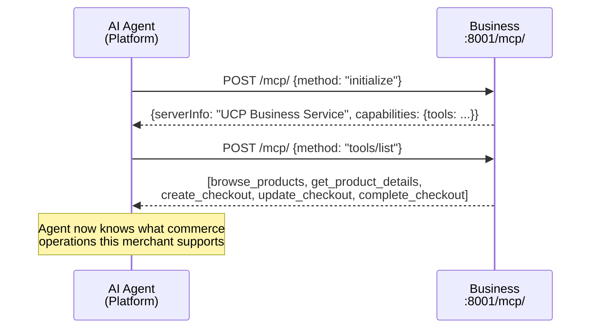
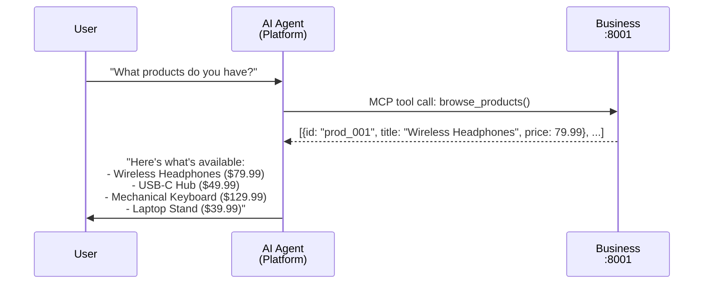
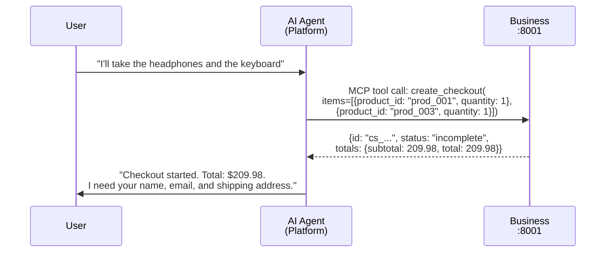
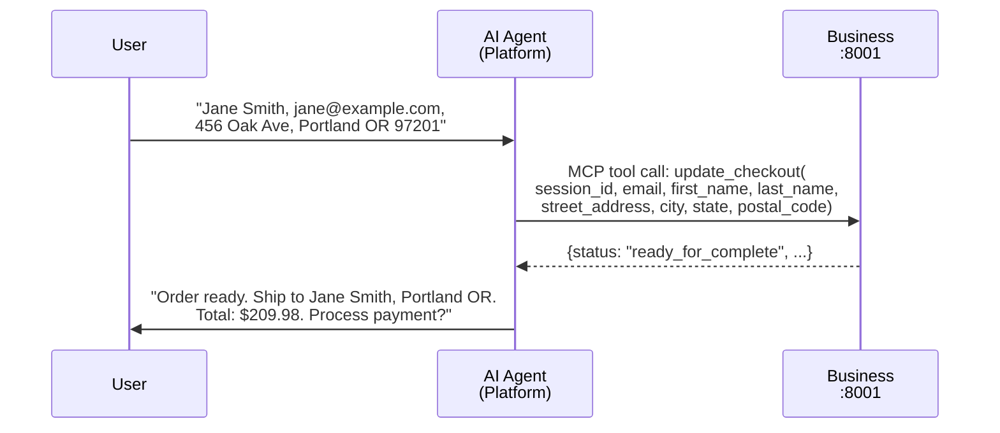
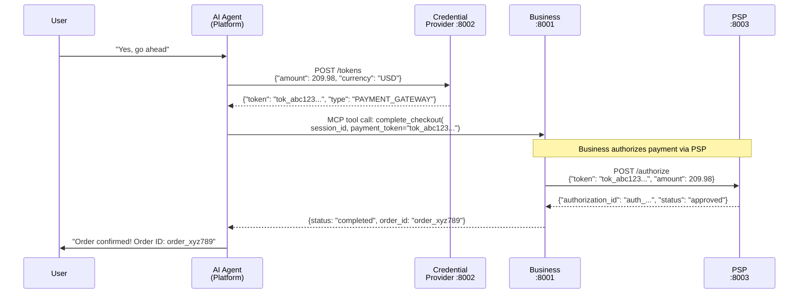
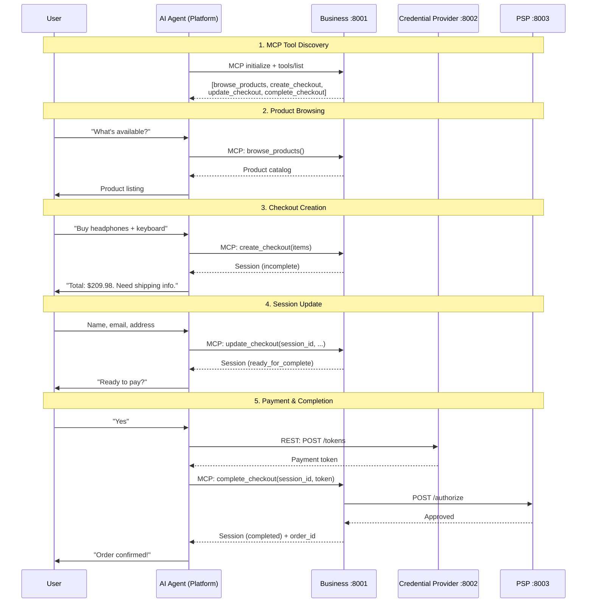

# UCP Agentic Commerce Demo

A sample implementation of agentic commerce using the [Universal Commerce Protocol (UCP)](https://ucp.dev/). AI shopping assistants guide users through product discovery and checkout — entirely through a chat interface.

UCP is an open standard co-developed by Google, Shopify, Etsy, Walmart, Target, and Wayfair that defines how platforms, AI agents, and businesses conduct commerce.

This demo includes two modes: a **single-store** frontend that talks directly to one merchant, and a **multi-store** frontend that searches across multiple merchants via an aggregator service.

## Architecture

### Single-Store Mode

The original frontend connects directly to one merchant's MCP endpoint:

```
┌──────────────────────────────────────────────────────┐
│         Next.js Chat App (Platform / Agent)          │
│         Vercel AI SDK + Claude tool calling          │
│                   localhost:3000                     │
└────────┬──────────────────┬──────────────┬───────────┘
         │ MCP (auto-       │ REST         │
         │ discovered       │              │
         │ tools)           │              │
         ▼                  ▼              ▼
┌─────────────┐   ┌─────────────┐   ┌───────────┐
│  Business   │   │ Credential  │   │    PSP    │
│  (Merchant) │   │  Provider   │   │ (Payment  │
│  :8001      │   │  :8002      │   │  Gateway) │
│  MCP + REST │   │  REST       │   │  :8003    │
└──────┬──────┘   └─────────────┘   └───────────┘
       │                                  ▲
       └──────── authorize payment ───────┘
```

### Multi-Store Mode

The multi-store frontend connects to an aggregator that proxies MCP calls across multiple merchants:

```
┌──────────────────────────────────────────────────────┐
│      Next.js Multi-Store Chat (Platform / Agent)     │
│         Vercel AI SDK + Claude tool calling          │
│                   localhost:3001                     │
└────────┬──────────────────────────────────┬──────────┘
         │ MCP (auto-discovered             │ REST
         │ aggregated tools)                │
         ▼                                  ▼
┌─────────────────┐                ┌─────────────┐
│   Aggregator    │                │ Credential  │
│   :8005         │                │  Provider   │
│   MCP proxy     │                │  :8002      │
└───┬─────────┬───┘                └─────────────┘
    │ MCP     │ MCP
    ▼         ▼
┌────────┐ ┌────────┐    ┌───────────┐
│Business│ │Business│    │    PSP    │
│  :8001 │ │ 2:8004 │───▶│  :8003    │
│Electr. │ │ Books  │    │           │
└────┬───┘ └────┬───┘    └───────────┘
     └──── authorize payment ──┘
```

The aggregator discovers each store's tools via MCP, then exposes unified tools (`search_products`, `create_checkout`, `update_checkout`, `complete_checkout`) that route to the correct store. Products are tagged with `store_id` and `store_name` so the agent knows which store to create checkouts against.

| Service | Role | Port |
|---------|------|------|
| **Frontend** | Single-store AI shopping assistant. Auto-discovers one merchant's tools via MCP. | 3000 |
| **Frontend Multi** | Multi-store AI shopping assistant. Discovers aggregated tools from multiple merchants. | 3001 |
| **Business** | UCP-compliant electronics merchant. MCP server + REST API. | 8001 |
| **Business 2** | UCP-compliant book store. Same architecture as Business, different catalog. | 8004 |
| **Aggregator** | MCP-to-MCP proxy. Queries multiple stores and exposes unified tools. | 8005 |
| **Credential Provider** | Simulates a digital wallet (e.g. Google Wallet, Apple Pay). Issues tokenized payment credentials. | 8002 |
| **PSP** | Simulates a payment processor (e.g. Stripe, Adyen). Authorizes payment tokens. | 8003 |

## Project Layout

```
ucp-example/
├── docker-compose.yml                 # Runs all backend services
│
├── frontend/                          # Single-store Next.js chat app
│   ├── app/
│   │   ├── page.tsx                   # Chat UI using useChat hook
│   │   └── api/chat/route.ts         # AI agent: MCP client + tool orchestration
│   └── lib/tools.ts                   # Credential Provider tool (direct REST)
│
├── frontend-multi/                    # Multi-store Next.js chat app
│   ├── app/
│   │   ├── page.tsx                   # Chat UI (multi-store variant)
│   │   └── api/chat/route.ts         # AI agent: connects to aggregator MCP
│   └── lib/tools.ts                   # Credential Provider tool (direct REST)
│
└── services/
    ├── business/                      # Electronics store (Python/FastAPI)
    │   ├── main.py                    # FastAPI app: REST routes + MCP server mount
    │   ├── mcp_tools.py               # MCP tool definitions (auto-discovered by agents)
    │   ├── models.py                  # Pydantic models (CheckoutSession, Buyer, etc.)
    │   ├── catalog.py                 # Product catalog (headphones, keyboard, etc.)
    │   ├── sessions.py                # Checkout session store + PSP integration
    │   ├── Dockerfile
    │   └── pyproject.toml
    │
    ├── business-2/                    # Book store (Python/FastAPI)
    │   ├── main.py                    # Same structure as business/
    │   ├── mcp_tools.py               # Same MCP tools, different store name
    │   ├── models.py                  # Shared model definitions
    │   ├── catalog.py                 # Book catalog (DDIA, SICP, Clean Code, etc.)
    │   ├── sessions.py                # Checkout session store + PSP integration
    │   ├── Dockerfile
    │   └── pyproject.toml
    │
    ├── aggregator/                    # Multi-store MCP proxy (Python/FastAPI)
    │   ├── main.py                    # FastAPI app with MCP server mount
    │   ├── mcp_tools.py               # Unified tools that proxy to individual stores
    │   ├── store_registry.py          # Store config loaded from STORES env var
    │   ├── Dockerfile
    │   └── pyproject.toml
    │
    ├── credential-provider/           # Python/FastAPI credential provider
    │   ├── main.py                    # POST /tokens — issues fake payment tokens
    │   ├── Dockerfile
    │   └── pyproject.toml
    │
    └── psp/                           # Python/FastAPI payment service provider
        ├── main.py                    # POST /authorize — approves payment tokens
        ├── Dockerfile
        └── pyproject.toml
```

## Quickstart

### Prerequisites

- Docker & Docker Compose
- Node.js >= 20
- An Anthropic API key

### 1. Start backend services

```sh
docker compose up --build
```

This starts all backend services: Business (electronics), Business 2 (books), Aggregator, Credential Provider, and PSP.

### 2. Start a frontend

**Single-store** (connects directly to the electronics store):

```sh
cd frontend
echo "ANTHROPIC_API_KEY=sk-ant-..." > .env.local
npm install
npm run dev
```

**Multi-store** (connects to the aggregator, searches across all stores):

```sh
cd frontend-multi
echo "ANTHROPIC_API_KEY=sk-ant-..." > .env.local
npm install
npm run dev
```

### 3. Open the chat

- Single-store: [http://localhost:3000](http://localhost:3000)
- Multi-store: [http://localhost:3001](http://localhost:3001)

## Key Interactions

### MCP Tool Discovery

On each chat request, the AI agent connects to the Business service's MCP endpoint and discovers available tools. No tools are hardcoded in the frontend — the merchant defines what operations are available.



### Product Discovery

The user asks what's available. The AI agent calls the auto-discovered `browse_products` tool.



### Checkout Session Creation

The user picks items. The agent creates a checkout session with the Business.



### Checkout Update (Buyer Info + Shipping)

The user provides personal and shipping details. The agent updates the session.



### Payment & Order Completion

The user confirms. The agent obtains a payment token from the Credential Provider, then completes the checkout. The Business service authorizes the payment through the PSP.



### Full End-to-End Flow



## API Reference

### Business Services (`:8001` electronics, `:8004` books)

Both business services expose identical interfaces with different product catalogs.

**MCP Endpoint** (`/mcp/`) -- auto-discovered tools:

| Tool | Description |
|------|-------------|
| `browse_products` | List all products in the catalog |
| `get_product_details` | Get details for a specific product by ID |
| `create_checkout` | Create a checkout session with selected items |
| `update_checkout` | Add buyer info and shipping address to a session |
| `complete_checkout` | Finalize purchase with a payment token |

**REST Endpoints** (also available):

| Method | Endpoint | Description |
|--------|----------|-------------|
| `GET` | `/.well-known/ucp` | UCP discovery document (includes MCP endpoint URL) |
| `GET` | `/products` | List all products |
| `GET` | `/products/{id}` | Get single product |
| `POST` | `/checkout-sessions` | Create checkout session |
| `GET` | `/checkout-sessions/{id}` | Get session state |
| `PUT` | `/checkout-sessions/{id}` | Update buyer/fulfillment info |
| `POST` | `/checkout-sessions/{id}/complete` | Complete with payment |

### Aggregator (`:8005`)

**MCP Endpoint** (`/mcp/`) -- unified tools across all stores:

| Tool | Description |
|------|-------------|
| `search_products` | Search products across all registered stores. Accepts optional `query` filter. Returns products tagged with `store_id` and `store_name`. |
| `create_checkout` | Create a checkout at a specific store (requires `store_id`). |
| `update_checkout` | Update a checkout session (routes to the correct store automatically). |
| `complete_checkout` | Complete a checkout (routes to the correct store automatically). |

**REST Endpoints:**

| Method | Endpoint | Description |
|--------|----------|-------------|
| `GET` | `/stores` | List registered stores and their MCP URLs |
| `GET` | `/health` | Health check |

The aggregator reads its store list from the `STORES` environment variable (JSON array).

### Credential Provider (`:8002`)

| Method | Endpoint | Description |
|--------|----------|-------------|
| `POST` | `/tokens` | Issue a tokenized payment credential |

### PSP (`:8003`)

| Method | Endpoint | Description |
|--------|----------|-------------|
| `POST` | `/authorize` | Authorize a payment token |

## Checkout Session Lifecycle

```
incomplete ──▶ ready_for_complete ──▶ completed
   │                                       │
   │  (buyer + fulfillment added)          │  (payment authorized)
   │                                       │
   └──────────── canceled ◀────────────────┘
```

## Tech Stack

| Component | Technology |
|-----------|-----------|
| Frontend | Next.js 16, React 19, Vercel AI SDK v6, Tailwind CSS |
| AI Model | Claude Sonnet via Anthropic API |
| Backend services | Python 3.12, FastAPI, Pydantic v2 |
| Dependency management | uv (Python), npm (Node.js) |
| Containerization | Docker, Docker Compose |

## UCP Spec Compliance

This demo implements both the [UCP REST](https://ucp.dev/latest/specification/overview/) and [UCP MCP](https://ucp.dev/latest/specification/checkout-mcp/) transport bindings:

- **Discovery**: `/.well-known/ucp` endpoint with capabilities, payment handlers, and MCP endpoint URL
- **MCP transport**: Business service exposes checkout capabilities as MCP tools, auto-discoverable by AI agents
- **REST transport**: Full checkout session lifecycle (create, read, update, complete)
- **Capability ID**: `dev.ucp.shopping.checkout` (version `2026-01-11`)
- **Payment handling**: Tokenized credentials via a separate Credential Provider, authorized through a PSP

The Business, Credential Provider, and PSP are intentionally simple (in-memory storage, simulated approvals) to focus on demonstrating the protocol flow rather than production infrastructure.
